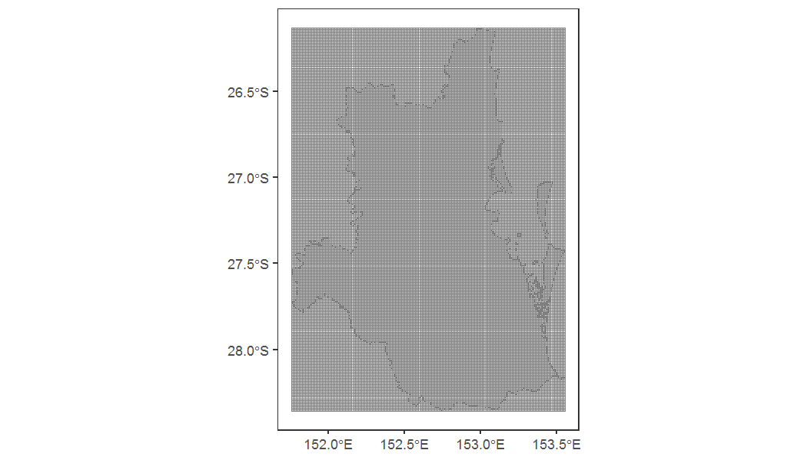

```r
library(SEQKoalaDataPipeline)
library(ggplot2)
```


# Initial setup

The package relies on a data directory (home_dir) that stores the
datasets used for the analysis. The first step involves setting the path
on the computer to a directory with the following files:

-   `basedata.gdb`: a ArcGIS geodatabase with the study area in it
    (`seqrp_study_area_2017_mga56`)

-   `final_covariates.gdb`: a ArcGIS geodatabase of the covariate raster
    layers

-   `final_covariates_raster`: a directory containing GeoTIFF files of
    the covariates from `final_covariates.gdb` because R does not read
    raster files from ArcGIS GDB

-   `koala_survey_data_ver2_0.gdb`: a geodatabase containing the koala
    survey data

-   `KoalaSurveyData2020_cur.accdb`: an ACCESS database containing data
    from 2020 onwards

-   `SEQkoalaData.accdb`: an ACCESS database containing data from
    1996-2015

This directory can be stored on anywhere on the computer.


```r
data_dir <- "M:\\Users\\uqfcho\\Documents\\seq-koala-monitoring\\working_data"
fcn_set_home_dir(data_dir)
list.files(data_dir)
#> [1] "basedata.gdb"                    "final_covariates.gdb"           
#> [3] "final_covariates_raster"         "final_covariates_raster_gda1994"
#> [5] "KoalaSurveyData.gdb"             "KoalaSurveyData2020_cur.accdb"  
#> [7] "SEQkoalaData.accdb"              "SEQkoalaData_info.pdf"
```

# Generate fishnet grid

Grids for the analysis can be generated on the fly by specifying the
grid size. After generating the grid by calling `fcn_set_grid_size`, the
grid feature class is stored in the local environment. Functions that
require this newly generated grid will be able to retrieve the grid
directly from the local environment.

Here we plot the grid to see how it covers the study area


```r
fcn_set_grid_size(1000) # grid width/ height in meters, and generate grid in local environment
#> Simple feature collection with 43472 features and 1 field
#> Geometry type: POLYGON
#> Dimension:     XY
#> Bounding box:  xmin: 378280 ymin: 6862464 xmax: 554280 ymax: 7109464
#> Projected CRS: GDA2020 / MGA zone 56
#> First 10 features:
#>                          geometry  GridID
#> 1  POLYGON ((378280 6862464, 3...  1000_1
#> 2  POLYGON ((379280 6862464, 3...  1000_2
#> 3  POLYGON ((380280 6862464, 3...  1000_3
#> 4  POLYGON ((381280 6862464, 3...  1000_4
#> 5  POLYGON ((382280 6862464, 3...  1000_5
#> 6  POLYGON ((383280 6862464, 3...  1000_6
#> 7  POLYGON ((384280 6862464, 3...  1000_7
#> 8  POLYGON ((385280 6862464, 3...  1000_8
#> 9  POLYGON ((386280 6862464, 3...  1000_9
#> 10 POLYGON ((387280 6862464, 3... 1000_10
fishnet <- fcn_get_grid() # Retrieve grid from environment for plotting
study_area <- fcn_get_study_area() # Retrieve study area
ggplot() +
  geom_sf(data = study_area, color = 'gray50', fill = 'gray90') +
  geom_sf(data = fishnet, color = 'gray50', fill = NA) +
  theme_bw()+
  theme(panel.grid = element_blank())
```



The `GridID` column in the fishnet feature class uniquely identifies
each grid cell in the fishnet and is specific the to the `grid_size`,
with the following format:

"Grid side width (in meters)"\_"Grid Number"
