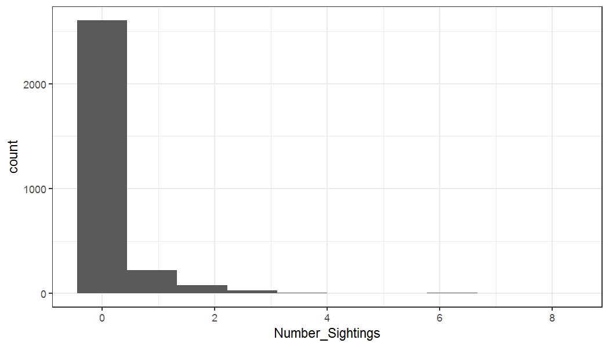

```r
library(SEQKoalaDataPipeline)
library(tidyterra)
library(ggplot2)
library(patchwork)
```

## Setup


```r
#data_dir <- "M:\\Users\\uqfcho\\Documents\\seq-koala-monitoring\\working_data"
data_dir <- "C:\\Users\\uqfcho\\Documents/seq-koala-monitoring/working_data"
fcn_set_home_dir(data_dir)
fcn_set_grid_size(100) # grid width/ height in meters, and generate grid in local environment
#> class       : SpatRaster 
#> dimensions  : 2467, 1759, 1  (nrow, ncol, nlyr)
#> resolution  : 100, 100  (x, y)
#> extent      : 378280, 554180, 6862464, 7109164  (xmin, xmax, ymin, ymax)
#> coord. ref. : GDA2020 / MGA zone 56 (EPSG:7856) 
#> source(s)   : memory
#> name        :  GridID 
#> min value   :       1 
#> max value   : 2311397
fishnet <- fcn_get_grid() # Retrieve grid from environment for plotting
```

# Extract data from the database

The line transect feature class table can be extracted from the ACCESS database directly through one function. Behind this function call, R does the following steps:

1.  Establishes the ODBC connection with the ACCESS database
2.  Executes SQL queries to pull data from that database
3.  Reads the columns with start and end northings and eastings
4.  Generates a spatial representation for each transect based on those columns

A one-liner solution to extract all line transect information from both 1996 and 2020 databases are as follows, producing the so-called "Master" database for the line transects.


```r
line_transects <- fcn_line_transect_sf_all()
#> Warning in fcn_keep_distinct(transect_sf): 24 records cannot be uniquely identified with
#> SiteNumber-TransectNumber-SurveyNumber. Keeping only distinct records.
#> Warning in fcn_line_transect_sf_1996(): Line Transect: attribute join incomplete. 
#> Joined uniquely: 376. 
#> Joined at the site level: 169. 
#> Join failed: 0
summary(line_transects)
#>       db             TransectID            SiteID            Date                           TrSiteID     
#>  Length:2963        Length:2963        Min.   :   1.0   Min.   :2001-08-28 00:00:00.00   Min.   :   1.0  
#>  Class :character   Class :character   1st Qu.: 122.0   1st Qu.:2020-06-19 00:00:00.00   1st Qu.: 111.0  
#>  Mode  :character   Mode  :character   Median : 416.0   Median :2021-07-21 00:00:00.00   Median : 417.0  
#>                                        Mean   : 509.8   Mean   :2019-06-22 07:14:28.71   Mean   : 483.3  
#>                                        3rd Qu.: 814.5   3rd Qu.:2022-03-23 00:00:00.00   3rd Qu.: 814.5  
#>                                        Max.   :1301.0   Max.   :2022-12-20 00:00:00.00   Max.   :1301.0  
#>                                                                                                          
#>     Tlength        Number_Sightings Number_Observers Start_Eastings   Start_Northings    End_Eastings   
#>  Min.   :  19.42   Min.   :0.0000   Min.   : 1.000   Min.   :399462   Min.   :6870195   Min.   :399394  
#>  1st Qu.: 226.04   1st Qu.:0.0000   1st Qu.: 2.000   1st Qu.:466312   1st Qu.:6939228   1st Qu.:466208  
#>  Median : 447.00   Median :0.0000   Median : 2.000   Median :491411   Median :6972056   Median :491319  
#>  Mean   : 524.78   Mean   :0.1974   Mean   : 2.086   Mean   :484205   Mean   :6975275   Mean   :484208  
#>  3rd Qu.: 733.81   3rd Qu.:0.0000   3rd Qu.: 2.000   3rd Qu.:501812   3rd Qu.:6998774   3rd Qu.:501743  
#>  Max.   :2281.24   Max.   :8.0000   Max.   :70.000   Max.   :550605   Max.   :7106583   Max.   :551033  
#>                                     NA's   :1        NA's   :169      NA's   :169       NA's   :169     
#>  End_Northings              geometry   
#>  Min.   :6870028   LINESTRING   :2794  
#>  1st Qu.:6939270   MULTIPOLYGON : 169  
#>  Median :6971992   epsg:7856    :   0  
#>  Mean   :6975276   +proj=utm ...:   0  
#>  3rd Qu.:6998793                       
#>  Max.   :7106708                       
#>  NA's   :169
```

```r
ggplot(line_transects, aes(x = Number_Sightings)) +
  geom_histogram(bins = 10) +
  theme_bw()
```



For this current iteration of the database, the line transects in the 1996 database cannot be joined completely with the transect-level spatial representation. When a unique transect-level spatial representation is found, the line transect record is joined to the transect-level spatial feature, but if that is not possible then it falls back to using the site-level spatial representation. Only if the site-level representation is not found does the algorithm fall back to removing that record. Here in this demonstration we see that the algorithm finds 386 line transect records that can be joined with the transect-level spatial feature, and 169 that can be joined at the site level. 0 records were discarded.

### 1996-2015 data

The user can also opt to extract just the line transect data from the 1996 database. The same warning message shows up notifying the end user that indeed some of the line transects had to be joined at the site-level.


```r
table_sf_1996 <- fcn_line_transect_sf_1996()
#> Warning in fcn_keep_distinct(transect_sf): 24 records cannot be uniquely identified with
#> SiteNumber-TransectNumber-SurveyNumber. Keeping only distinct records.
#> Warning in fcn_line_transect_sf_1996(): Line Transect: attribute join incomplete. 
#> Joined uniquely: 376. 
#> Joined at the site level: 169. 
#> Join failed: 0
nrow(table_sf_1996)
#> [1] 545
```

### 2020 onwards data

Equivalently we can extract the data for the 2020 database. No errors are thrown here because each line transect is identified uniquely using coordinate information.

```r
table_sf_2020 <- fcn_line_transect_sf_2020()
nrow(table_sf_2020)
#> [1] 2418
```

Define the bounding box for plotting


```r
bbox <- list(xlim = c(441430, 449400), ylim = c(6928706, 6936814), expand = F)
bbox_sf <- sf::st_polygon(list(matrix(c(bbox$xlim[1], bbox$ylim[1], bbox$xlim[2], bbox$ylim[1], bbox$xlim[1], bbox$ylim[2], bbox$xlim[2], bbox$ylim[2],bbox$xlim[1], bbox$ylim[1]), ncol=2, byrow=T)))
bbox_sf <- sf::st_sfc(bbox_sf)
sf::st_crs(bbox_sf) <- fcn_get_state()$crs
```

We can draw a simple plot to show the line transects for any particular region with ggplot. Here we plot the line transects and the grid cells.


```r
fishnet_bbox <- terra::crop(fishnet, terra::vect(bbox_sf))
fishnet_plot <- ggplot() +
  geom_spatraster(data = fishnet_bbox %>% mutate(grid_id_plot = substr(GridID, nchar(GridID), nchar(GridID))), aes(fill = grid_id_plot)) +
  do.call(coord_sf, bbox) +
  theme_bw()+
  scale_fill_brewer(palette = "Set3") +
  guides(fill = 'none')+
  theme(panel.grid = element_blank())
transect_plot <- ggplot() +
  geom_sf(data = line_transects, color = '#D55E00') +
  do.call(coord_sf, bbox) +
  theme_bw()+
  theme(panel.grid = element_blank())
fishnet_plot + transect_plot
```


## Perpendicular distances
Perpendicular distances can be extracted with the following function calls. It produces the following columns:

1. TransectID: matches many-to-one to TransectID in line transect tables

2. SightingID: uniquely identifies each koala sighting, with id assigned as "TransectID"."SightingNumber"

3. Perp_Dist: perpendicular distance of the koala sighting


```r
perp_distance_1996 <- fcn_perp_distance_table_1996()
perp_distance_2020 <- fcn_perp_distance_table_2020()
perp_distance_all <- fcn_perp_distance_all()
```

This following line checks if the number of koala sightings in the line transect table matches the number of koala sightings reported in the perpendicular distances table. Both numbers should be identical as a sign of successful data extraction.


```r
nrow(perp_distance_all)
#> [1] 585
sum(line_transects$Number_Sightings)
#> [1] 585
```

# Strip transects

Strip transects are extracted using a similar interface. Likewise to line transects, the strip transects are joined with its spatial representation in the geodatabase, with a fallback to joining at the site level if an exact match at the transect level is not found.


```r
strip_transects <- fcn_strip_transect_sf_all()
#> Warning in fcn_keep_distinct(transect_sf, cols = c("SiteNumber", "TransectNumber", : 83 records cannot be
#> uniquely identified with SiteNumber-TransectNumber-SurveyNumber. Keeping only distinct records.
#> Warning in fcn_strip_transect_sf_all(): Strip Transect: attribute join incomplete. 
#> Joined uniquely: 916. 
#> Joined at the site level: 1726. 
#> Join failed: 0
```

# All of area searches

Similarly, data for all of area searches can be extracted using the following function:

```r
uaoa <- fcn_all_of_area_sf_all()
sum(uaoa$Number_Sightings)
#> [1] 650
```

# Summary tables
The script `fcn_all_tables` extracts all tables into a list structure. 

```r
master <- fcn_all_tables()
```

Summary statistics can be produced of the full table. For example, to count the number of koalas sighted in each LGA.


```r
summary_table <- fcn_summarise_sightings(c('LGA', 'Method', 'db'))
#> Warning: The `.dots` argument of `group_by()` is deprecated as of dplyr 1.0.0.
#> ℹ The deprecated feature was likely used in the dplyr package.
#>   Please report the issue at <https://github.com/tidyverse/dplyr/issues>.
#> This warning is displayed once every 8 hours.
#> Call `lifecycle::last_lifecycle_warnings()` to see where this warning was generated.
summary_table
#> # A tibble: 27 × 4
#> # Groups:   LGA, Method [26]
#>    LGA            Method         db        Sightings
#>    <chr>          <chr>          <chr>         <int>
#>  1 Brisbane       line_transect  2020-cur         33
#>  2 Brisbane       strip_transect 1996-2015       743
#>  3 Brisbane       uaoa           1996-2015         0
#>  4 Gold Coast     line_transect  2020-cur         41
#>  5 Gold Coast     strip_transect 1996-2015        29
#>  6 Gold Coast     uaoa           1996-2015        24
#>  7 Ipswich        line_transect  2020-cur         47
#>  8 Ipswich        strip_transect 1996-2015        37
#>  9 Ipswich        uaoa           1996-2015         3
#> 10 Lockyer Valley line_transect  2020-cur          6
#> # ℹ 17 more rows
```
