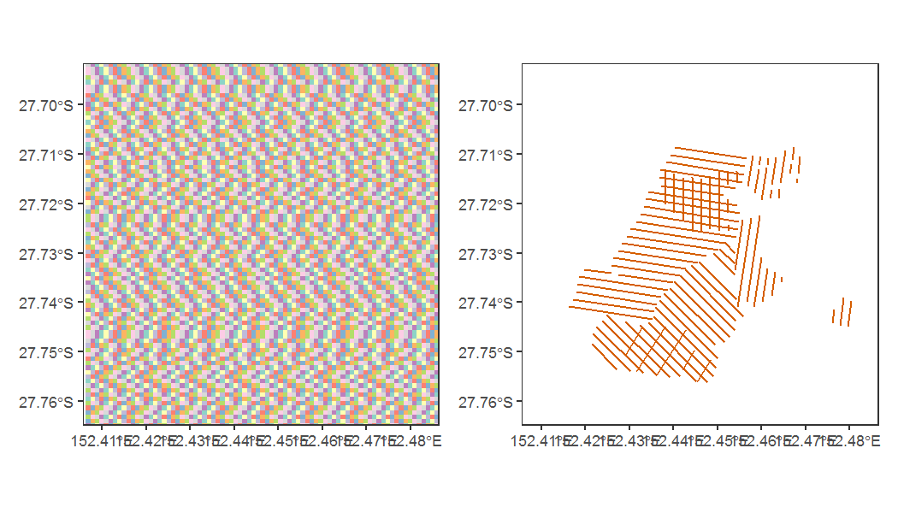

```r
library(SEQKoalaDataPipeline)
library(tidyterra)
```


# Extract data from the database

## Get transect (1996-2015) data

Work in progress

## Get line transect (2020 onwards) data

The line transect feature class table can be extracted from the ACCESS
database directly through one function. Behind this function call, R
does the following steps:

1.  Establishes the ODBC connection with the ACCESS database
2.  Executes SQL queries to pull data from that database
3.  Reads the columns with start and end northings and eastings
4.  Generates a spatial representation for each transect based on those
    columns


```r
#data_dir <- "M:\\Users\\uqfcho\\Documents\\seq-koala-monitoring\\working_data"
data_dir <- "C:\\Users\\uqfcho\\Documents/seq-koala-monitoring/working_data"
fcn_set_home_dir(data_dir)
table_sf_2020 <- fcn_line_transect_sf_2020()
fcn_set_grid_size(100) # grid width/ height in meters, and generate grid in local environment
#> class       : SpatRaster 
#> dimensions  : 2467, 1759, 1  (nrow, ncol, nlyr)
#> resolution  : 100, 100  (x, y)
#> extent      : 378280, 554180, 6862464, 7109164  (xmin, xmax, ymin, ymax)
#> coord. ref. : GDA2020 / MGA zone 56 (EPSG:7856) 
#> source(s)   : memory
#> name        :  GridID 
#> min value   :       1 
#> max value   : 2311397
fishnet <- fcn_get_grid() # Retrieve grid from environment for plotting
```

Define the bounding box for plotting

```r
bbox <- list(xlim = c(441430, 449400), ylim = c(6928706, 6936814), expand = F)
bbox_sf <- sf::st_polygon(list(matrix(c(bbox$xlim[1], bbox$ylim[1], bbox$xlim[2], bbox$ylim[1], bbox$xlim[1], bbox$ylim[2], bbox$xlim[2], bbox$ylim[2],bbox$xlim[1], bbox$ylim[1]), ncol=2, byrow=T)))
bbox_sf <- sf::st_sfc(bbox_sf)
sf::st_crs(bbox_sf) <- fcn_get_state()$crs
```

We can draw a simple plot to show the line transects for any particular
region with ggplot. Here we plot the line transects and the grid cells.


```r
fishnet_bbox <- terra::crop(fishnet, terra::vect(bbox_sf))
fishnet_plot <- ggplot() +
  geom_spatraster(data = fishnet_bbox %>% mutate(grid_id_plot = substr(GridID, nchar(GridID), nchar(GridID))), aes(fill = grid_id_plot)) +
  do.call(coord_sf, bbox) +
  theme_bw()+
  scale_fill_brewer(palette = "Set3") +
  guides(fill = 'none')+
  theme(panel.grid = element_blank())
transect_plot <- ggplot() +
  geom_sf(data = table_sf_2020, color = '#D55E00') +
  do.call(coord_sf, bbox) +
  theme_bw()+
  theme(panel.grid = element_blank())
fishnet_plot + transect_plot
```


