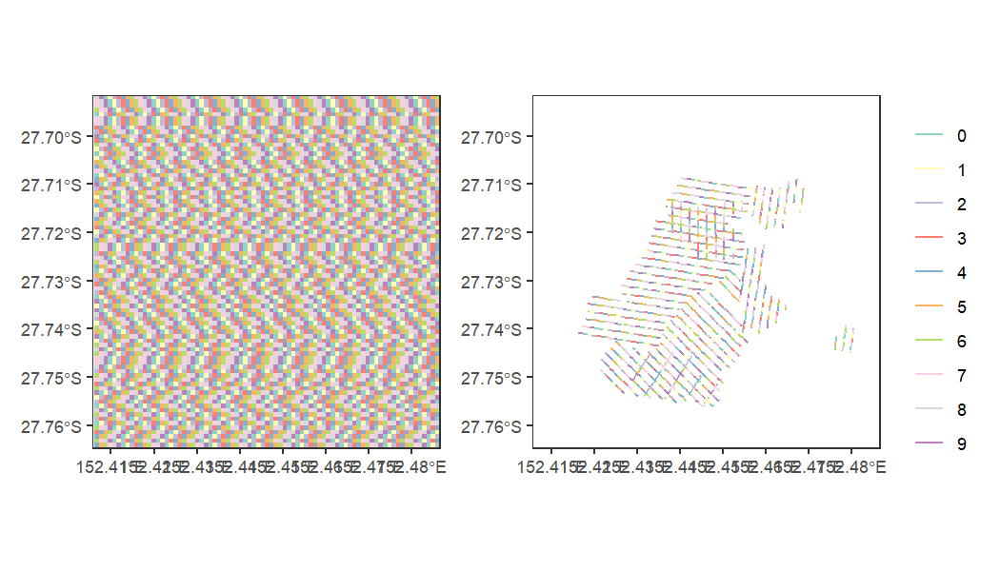

```r
library(SEQKoalaDataPipeline)
library(ggplot2)
library(dplyr)
```


## Linear referencing / dynamic segmentation

The linear referencing/ dynamic segmentation approach is used to relate
the line transects with the grid information and covariate layers. While
it can be used to derive outputs for the statistical model, the tables
generated by linear referencing itself could serve other purposes.

The toolbox for linear referencing in this package allows the user to
generate a "Route Event Layer" (also referred to as "Route Event Tables"
or "Route Table") that are the fundamental way which routes (i.e.
Transects) are represented in linear referencing.

In the linear referencing terminology, each transect is represented as a
"route". Each record in the "Route Event Layer" that stores the distance
from the start of a transect of where an "Event" occurred. An event can
be an intersection with a grid cell, or certain values within the
covariate layer. Using the `fcn_route_table` call, we can create a
"Route Event Layer" that records each "Event" and has a TransectID that
relates each event back to the transect concerned.

The function call creates a few new columns that records the attributes
of the event:

1.  FMEAS: the "From Measure", which is the distance from the start
    point of the transect where the event starts
2.  TMEAS: the "To Measure", which is the distance from the start point
    of the transect where the event ends
3.  Variable Name (e.g. GridID): the value of the event, in this case,
    the GridID of the grid cell this "Event" is describing
4.  Tlength: transect length
5.  lpercent: the percentage (proportion) of the transect that is
    covered by this event


```r
data_dir <- "M:\\Users\\uqfcho\\Documents\\seq-koala-monitoring\\working_data"
fcn_set_home_dir(data_dir)
table_sf_2020 <- fcn_line_transect_sf_2020()
fcn_set_grid_size(1000) # grid width/ height in meters, and generate grid in local environment
#> Simple feature collection with 43472 features and 1 field
#> Geometry type: POLYGON
#> Dimension:     XY
#> Bounding box:  xmin: 378280 ymin: 6862464 xmax: 554280 ymax: 7109464
#> Projected CRS: GDA2020 / MGA zone 56
#> First 10 features:
#>                          geometry  GridID
#> 1  POLYGON ((378280 6862464, 3...  1000_1
#> 2  POLYGON ((379280 6862464, 3...  1000_2
#> 3  POLYGON ((380280 6862464, 3...  1000_3
#> 4  POLYGON ((381280 6862464, 3...  1000_4
#> 5  POLYGON ((382280 6862464, 3...  1000_5
#> 6  POLYGON ((383280 6862464, 3...  1000_6
#> 7  POLYGON ((384280 6862464, 3...  1000_7
#> 8  POLYGON ((385280 6862464, 3...  1000_8
#> 9  POLYGON ((386280 6862464, 3...  1000_9
#> 10 POLYGON ((387280 6862464, 3... 1000_10
fishnet <- fcn_get_grid() # Retrieve grid from environment for plotting
bbox <- list(xlim = c(441430, 449400), ylim = c(6928706, 6936814), expand = F)
```


```r
route_table <- fcn_route_table(fishnet, table_sf_2020)
#> Warning: attribute variables are assumed to be spatially constant
#> throughout all geometries
head(route_table[route_table$lpercent < 0.5,c('TransectID', 'GridID', 'FMEAS', 'TMEAS', "Tlength", "lpercent")])
#>             TransectID     GridID    FMEAS     TMEAS   Tlength  lpercent
#> 1.1 1.0_0_SOL.20210810 1000_14746 300.0884  484.1095  484.1095 0.3801229
#> 2.1 1.0_1_SOL.20210810 1000_14745 590.6152  705.2055  960.0208 0.1193623
#> 2   1.0_1_SOL.20210810 1000_14569 705.2055  960.0208  960.0208 0.2654269
#> 3   1.0_2_SOL.20210810 1000_14569   0.0000  442.9913 1306.0907 0.3391734
#> 3.1 1.0_2_SOL.20210810 1000_14570 442.9913  765.5946 1306.0907 0.2469991
#> 3.2 1.0_2_SOL.20210810 1000_14746 765.5946 1306.0907 1306.0907 0.4138274
```

The results of the event route layer can be viewed by using
`fcn_locate_feature_from_route` which segments the line transects based
on the route event layer. This operation segments the line transects
many different small segments - it could be slow if the route event
layer is large, especially if applied to high-resolution grid cells or
route event layers of rasterized covariate layers (described below). In
many cases, the route event layer table itself is a sufficient spatial
representation of the linear referencing results, but only by doing this
step can we inspect the results visually.

Here, we see that the line transects are successfully segmented at the
border of the grid cells, as colored by different ID numbers of the Grid
where transects are colored by the last digit of the GridID:


```r
route_features <- fcn_locate_feature_from_route(route_table, table_sf_2020)
ggplot() +
  geom_sf(data = fishnet, color = 'gray50', fill = 'gray80') +
  geom_sf(data = route_features, aes(color = substr(GridID, nchar(GridID), nchar(GridID))), linewidth = 1) +
  do.call(coord_sf, bbox) +
  scale_color_brewer(palette = "Set3") +
  labs(color = "") +
  #guides(color = 'none')+
  theme_bw()+
  theme(panel.grid = element_blank())
```


