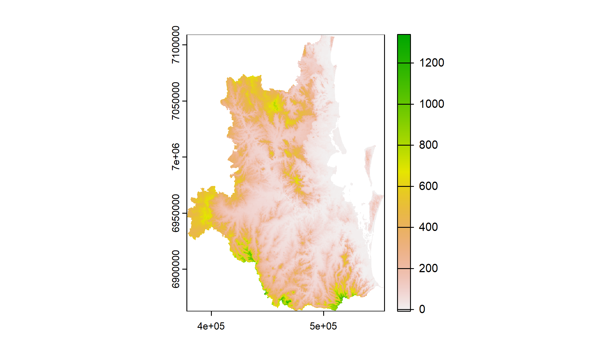
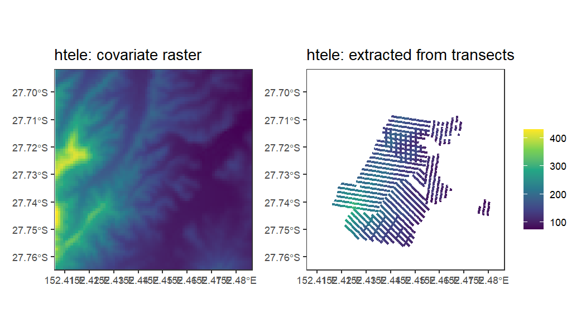
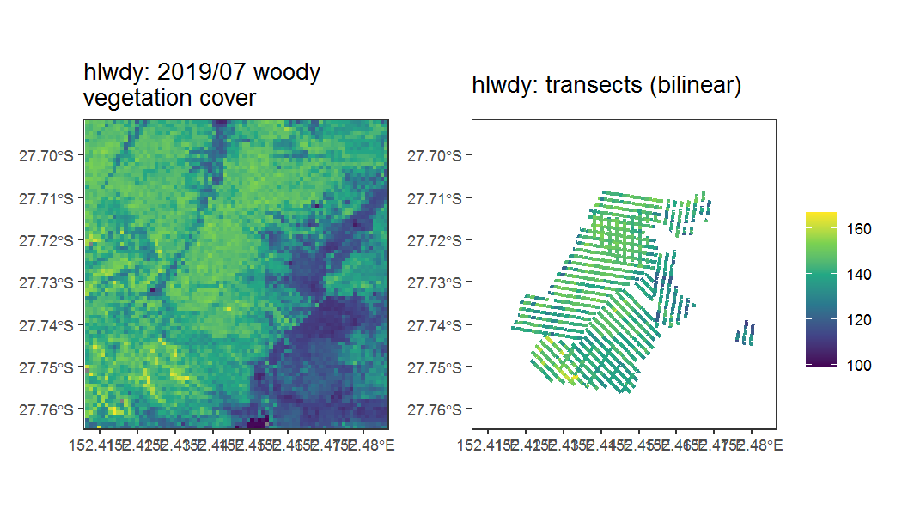

```r
library(SEQKoalaDataPipeline)
library(dplyr)
library(ggplot2)
library(tidyterra)
library(patchwork)
```

Get data

```r
data_dir <- "M:\\Users\\uqfcho\\Documents\\seq-koala-monitoring\\working_data"
fcn_set_home_dir(data_dir)
table_sf_2020 <- fcn_line_transect_sf_2020()
fcn_set_grid_size(1000) # grid width/ height in meters, and generate grid in local environment
#> class       : SpatRaster 
#> dimensions  : 2467, 1759, 1  (nrow, ncol, nlyr)
#> resolution  : 100, 100  (x, y)
#> extent      : 378280, 554180, 6862464, 7109164  (xmin, xmax, ymin, ymax)
#> coord. ref. : GDA2020 / MGA zone 56 (EPSG:7856) 
#> source(s)   : memory
#> name        :   lyr.1 
#> min value   :       1 
#> max value   : 2311397
fishnet <- fcn_get_grid() # Retrieve grid from environment for plotting
```

# Covariate extraction

## Atemporal rasters covariate extraction

Likewise, the capabilities of linear referencing can be applied to
extract covariate information from Raster files. The raster layer can be
loaded using `fcn_covariate_raster_load`.


```r
cov <- fcn_covariate_raster_load("htele")
cov_route_table <- fcn_route_table_raster(cov, table_sf_2020)
terra::plot(cov)
```

<div class="figure">

<p class="caption">plot of chunk unnamed-chunk-3</p>
</div>

The results of the linear referencing (route event layer) can be
inspected by using the same approach as above. Creation of the segments
could take a while. As seen in the outputs, the values of the event
layer (red) closely match that of the underlying raster layer (in blue).

```r
head(cov_route_table)
#>           TransectID       Date  Tlength    htele     FMEAS    TMEAS segment_length
#> 1 1.0_0_SOL.20210810 2021-08-10 484.1095 98.12856  39.51914 128.4372       88.91807
#> 2 1.0_0_SOL.20210810 2021-08-10 484.1095 90.80862 128.43721 167.9564       39.51914
#> 3 1.0_0_SOL.20210810 2021-08-10 484.1095 93.57124 167.95635 276.6340      108.67764
#> 4 1.0_0_SOL.20210810 2021-08-10 484.1095 87.75922 276.63400 296.3936       19.75957
#> 5 1.0_0_SOL.20210810 2021-08-10 484.1095 90.65904 296.39357 434.7106      138.31700
#> 6 1.0_0_SOL.20210810 2021-08-10 484.1095 99.36454 434.71056 484.1095       49.39893
#>     lpercent
#> 1 0.18367347
#> 2 0.08163265
#> 3 0.22448980
#> 4 0.04081633
#> 5 0.28571429
#> 6 0.10204082
```


```r
cov_route_features <- fcn_locate_feature_from_route(cov_route_table, table_sf_2020)
bbox <- list(xlim = c(441430, 449400), ylim = c(6928706, 6936814), expand = F)
ext <- terra::ext(bbox$xlim[1], bbox$xlim[2], bbox$ylim[1], bbox$ylim[2])
cov_crop <- terra::crop(cov, ext)
limits <- terra::minmax(cov_crop)
rast_plot <- ggplot() +
  geom_spatraster(data = cov_crop) +
  do.call(coord_sf, bbox)+
  labs(fill = "") +
  ggtitle("htele: covariate raster") +
  scale_fill_viridis_c(limits = c(limits[1], limits[2])) +
  #guides(color = 'none')+
  theme_bw()+
  theme(panel.grid = element_blank())
transect_plot <- ggplot() +
  geom_sf(data = cov_route_features, aes(color = htele), linewidth = 1) +
  do.call(coord_sf, bbox)+
  ggtitle("htele: extracted from transects") +
  labs(color = "") +
  scale_color_viridis_c(limits = c(limits[1], limits[2])) +
  theme_bw()+
  theme(panel.grid = element_blank())
rast_plot + transect_plot + plot_layout(guides = 'collect')
```



## Spatio-temporal rasters

Extraction of covariates from spatio-temporal raster files are also
supported. The algorithm first extracts spatio-temporal rasters as a
multi-layer SpatRaster in `terra` and creates the Event Route Layer from
all spatio-temporal layers.


```r
cov_sptemp <- fcn_covariate_raster_load("hlwdy")
names(cov_sptemp)
#>  [1] "X199607" "X199707" "X199807" "X199907" "X200007" "X200107" "X200207"
#>  [8] "X200307" "X200407" "X200507" "X200607" "X200707" "X200807" "X200907"
#> [15] "X201007" "X201107" "X201207" "X201307" "X201407" "X201507" "X201607"
#> [22] "X201707" "X201807" "X201907"
```

The covariates are extracted as a multi-layer "SpatRaster" (from the
`terra` package) where the names of the raster layers represents the
dates of the raster layer. Where only the year and month of the raster
layers are available, the dates of the raster layers are assumed to be
taken on the 15th of the month. The date of the month is expected to
have a relatively small effect on the covariate extracted.


```r
cov_sptemp_route_table <- fcn_route_table_raster(cov_sptemp, table_sf_2020)
#> Error in eval(expr, envir, enclos): external pointer is not valid
```

The covariate value of the route event layer can be matched to the date
of the survey. The covariate value representative of the date which the
transect is surveyed can be interpolated by the following methods:

-   bilinear: bilinear interpolation between the two closest dates of
    the survey date, weighted by how close the survey is to the two
    dates. If the survey date is earlier or later than all of the dates
    of the covariate layers, then the earliest or latest covariate layer
    is selected respectively

-   nearest: the covariate layer closest to the survey date is used

-   "lag1" / "lag2" / "lag3" (work in progress): lagged layers -- select
    the first, second or third layer available earlier than the survey
    date. If the lagged layer is not available, then select the earliest
    layer available.


```r
route_table_date_matched <- fcn_covariate_match_date(cov_sptemp_route_table, names(cov_sptemp), method = 'bilinear')
head(route_table_date_matched)
#>           TransectID       Date  Tlength X199607 X199707 X199807 X199907 X200007
#> 1 1.0_0_SOL.20210810 2021-08-10 484.1095     161     164     166     166     165
#> 2 1.0_0_SOL.20210810 2021-08-10 484.1095     163     166     167     168     168
#> 3 1.0_0_SOL.20210810 2021-08-10 484.1095     159     160     162     164     166
#> 4 1.0_0_SOL.20210810 2021-08-10 484.1095     160     162     164     166     167
#> 5 1.0_0_SOL.20210810 2021-08-10 484.1095     163     167     168     170     170
#> 6 1.0_0_SOL.20210810 2021-08-10 484.1095     162     164     164     164     164
#>   X200107 X200207 X200307 X200407 X200507 X200607 X200707 X200807 X200907 X201007
#> 1     164     164     164     163     163     162     162     163     166     170
#> 2     169     171     172     169     165     161     158     158     162     166
#> 3     167     169     170     169     164     158     156     159     167     173
#> 4     168     169     169     167     163     158     155     157     164     170
#> 5     171     171     171     168     165     161     159     161     165     171
#> 6     165     165     165     164     160     156     153     154     158     164
#>   X201107 X201207 X201307 X201407 X201507 X201607 X201707 X201807 X201907     FMEAS
#> 1     172     172     171     168     164     161     161     162     167  39.51914
#> 2     169     169     168     165     164     163     164     162     162 128.43721
#> 3     176     174     169     164     161     161     163     161     161 167.95635
#> 4     174     173     169     165     163     162     163     161     161 276.63400
#> 5     174     174     170     166     163     162     163     162     163 296.39357
#> 6     172     176     175     171     164     157     151     155     159 434.71056
#>      TMEAS segment_length   lpercent value
#> 1 128.4372       88.91807 0.18367347   167
#> 2 167.9564       39.51914 0.08163265   162
#> 3 276.6340      108.67764 0.22448980   161
#> 4 296.3936       19.75957 0.04081633   161
#> 5 434.7106      138.31700 0.28571429   163
#> 6 484.1095       49.39893 0.10204082   159
```

The date matching algorithm creates / overwrites the "value" column in
the route_table as an output. Here we preview the extracted,
interpolated value next to the most recent layer of the spatio-temporal
raster.


```r
cov_sptemp_date_matched <- fcn_locate_feature_from_route(route_table_date_matched, table_sf_2020)
ext <- terra::ext(bbox$xlim[1], bbox$xlim[2], bbox$ylim[1], bbox$ylim[2])
cov_sptemp_crop <- terra::crop(cov_sptemp, ext)
#> Error in eval(expr, envir, enclos): external pointer is not valid
limits <- terra::minmax(cov_sptemp_crop)
rast_sptemp_plot <- ggplot() +
  geom_spatraster(data = cov_sptemp_crop, aes(fill = X201907)) +
  do.call(coord_sf, bbox)+
  labs(fill = "") +
  ggtitle("hlwdy: 2019/07 woody \nvegetation cover") +
  scale_fill_viridis_c(limits = c(limits[1], limits[2])) +
  #guides(color = 'none')+
  theme_bw()+
  theme(panel.grid = element_blank())
transect_sptemp_plot <- ggplot() +
  geom_sf(data = cov_sptemp_date_matched, aes(color = value), linewidth = 1) +
  do.call(coord_sf, bbox)+
  ggtitle("hlwdy: transects (bilinear)") +
  labs(color = "") +
  scale_color_viridis_c(limits = c(limits[1], limits[2])) +
  theme_bw()+
  theme(panel.grid = element_blank())
rast_sptemp_plot + transect_sptemp_plot + plot_layout(guides = 'collect')
```


